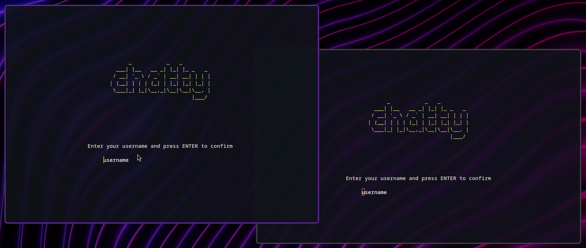

<div align="center">
  <pre>
       _           _   _         
   ___| |__   __ _| |_| |_ _   _ 
  / __| '_ \ / _` | __| __| | | |
 | (__| | | | (_| | |_| |_| |_| |
  \___|_| |_|\__,_|\__|\__|\__, |
                           |___/ 
  </pre>
  <h1>chatty</h1>
  <p>A Linux terminal-based peer-to-peer chat application built in C++23</p>
  
  
</div>

## Architecture

Chatty utilizes a two stage networking model, based on standard Unix C networking:

*   **Peer Discovery (UDP)**: The application broadcasts discovery packets over UDP on port `1337` to `255.255.255.255` to find other peers on the local network. 
*   **Point-to-Point Communication (TCP)**: Once a peer is selected, a direct TCP connection is established for reliable, bidirectional messaging. The protocol handles large messages using a length-prefixed streaming approach (up to 64KB per message).

## Build Instructions

### Prerequisites
*   A compiler with **C++23** support (tested on g++ 16.1.1 , clang++ 22.1.6)
*   **CMake** (3.25+)

### Getting the Source
```bash
git clone --recurse-submodules https://github.com/tymongumienik/chatty.git
```
Or if you've already cloned without submodules:
```bash
git submodule update --init --recursive
```

### Debug Build
A script is provided to quickly build the project:
```bash
./build.sh
```

Alternatively, to explicitly build in Debug mode:
```bash
cmake -B build -DCMAKE_BUILD_TYPE=Debug
cmake --build build
```

### Release Build
For maximum performance and compiler optimizations:
```bash
cmake -B build -DCMAKE_BUILD_TYPE=Release
cmake --build build
```

## Running Tests
Unit tests are included and can be built and run using:
```bash
./test.sh
```

## Limitations

*   **Local Network Only**: Because peer discovery relies on UDP broadcasts, you can currently only discover and connect to peers on the same LAN network.
*   **No Encryption**: All TCP and UDP packets are transmitted over the network in plaintext. There is no E2E encryption implemented.
*   **One-to-One Chats Only**: The application supports 1-on-1 chatting; group chats are not supported.

## Used Libraries

*   **[FTXUI](https://github.com/arthursonzogni/ftxui)**: A modern C++ library for terminal-based user interfaces.
*   **[unique_resource](https://github.com/okdshin/unique_resource)**: A C++ utility library for RAII-style resource management of POSIX file descriptors and other resources.
